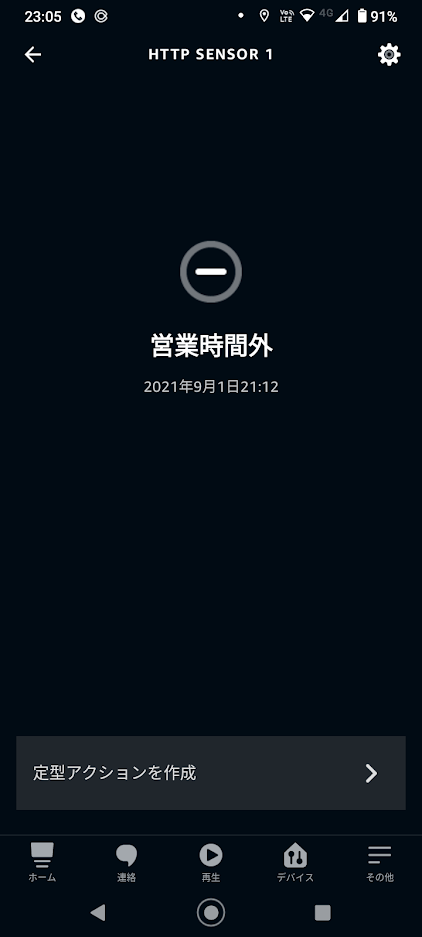

# alexa-skill-lambda-http-sensor

Alexa Smart Home Skill HTTP Sensor

HTTPリクエストをトリガーに、Alexaの定型アクションを実行するためのダミーコンタクトセンサーです。  
利用には、[alexa-skill-endpoint-http-sensor](https://github.com/nana4rider/alexa-skill-endpoint-http-sensor)を自身のサーバーに設置する必要があります。



## 初期設定
### AWS CLIのインストール
https://docs.aws.amazon.com/ja_jp/cli/latest/userguide/install-cliv2.html

### コマンドの実行
```
npm install
npm run set-handler
```

### Lambda環境変数の設定
`NUMBER_OF_DEVICES`に、登録したいセンサーの数を設定します。

### AWSにデプロイ
```
npm run deploy
```
